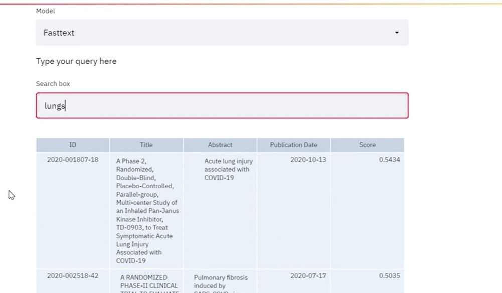

# medical_word_embeddings_clincal_trail

## The project aims to train the Skip-gram and FastText models for performing word 
embeddings and then building a search engine along with a Streamlit UI.

### Tech stack 
Language - Python
Libraries and Packages - pandas, numpy, matplotlib, plotly, gensim, streamlit, nltk

## Approach:
1. Importing the required libraries
2. Reading the dataset
3. Pre-processing
 Remove URLs
 Convert text to lower case
 Remove numerical values
 Remove punctuation.
 Perform tokenization
 Remove stop words
 Perform lemmatization 
 Remove ‘\n’ character from the columns
4. Exploratory Data Analysis (EDA) 
 Data Visualization using word cloud
5. Training the ‘Skip-gram’ model
6. Training the ‘FastText’ model
7. Model embeddings – Similarity 
8. PCA plots for Skip-gram and FastText models
9. Convert abstract and title to vectors using the Skip-gram and FastText model
10.Use the Cosine similarity function
11.Perform input query pre-processing
12.Define a function to return top ‘n’ similar results 
13.Result evaluation
14.Run the Streamlit Application

## Result:

 
